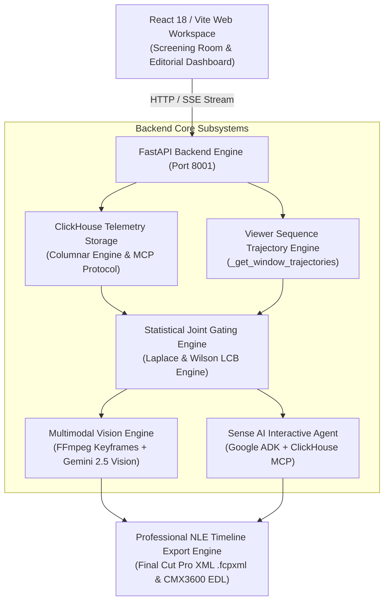

# Frame Sense

**Autonomous Post-Production Telemetry & Multimodal Vision Intelligence System**  
*Built for the **Agentic Cinema: The Blockbuster Hackathon***

---

## Executive Overview

**Frame Sense** is an autonomous post-production intelligence system that transforms second-by-second test-screening viewer behavior into scientifically defensible, frame-accurate editorial recommendations. 

By combining high-throughput columnar telemetry ingestion (**ClickHouse Cloud**), sample-aware statistical joint gating, viewer sequence trajectory reasoning, and multimodal keyframe reasoning (**Google ADK & Gemini 2.5 Vision**), Frame Sense automatically detects audience retention drops, comprehension barriers, and pacing friction — outputting industry-standard NLE timeline exports (**Final Cut Pro XML** and **CMX3600 EDL**) for Adobe Premiere Pro, DaVinci Resolve, and Final Cut Pro.

---

## The Problem Value & High-Stakes Impact

In film post-production, **director cuts often suffer 30%–50% audience retention drop-offs** during test screenings before final theatrical release. Studios traditionally rely on retrospective paper survey cards and focus group discussions.

### Structural Limitations of Traditional Methods
1. **Recall Bias & Subjectivity**: Viewers report feelings minutes or hours after watching, masking exact second-by-second micro-reactions.
2. **Lack of Frame Correlation**: Paper feedback tells filmmakers *"the middle felt slow"*, but fails to pinpoint whether the friction was caused by dialogue density, audio mix imbalance, or visual dead space at `00:26:14`.
3. **High Remediation Cost**: Reshooting or re-editing scenes without frame-accurate telemetry risks removing high-value narrative beats while leaving actual dead space intact.

---

## System Architecture & Data Flow



---

## Core Technical Approaches & Algorithms

### 1. Viewer Sequence Trajectory Reasoning

Events are **not** viewers. Counting raw event occurrences ($k$) without session tracking misidentifies intentional viewer rewatching as audience abandonment.

Frame Sense runs a ClickHouse SQL window trajectory query evaluating each viewer session's complete lifecycle across a candidate window $W = [t_{\text{start}}, t_{\text{end}}]$:

$$\text{Session Trajectory} = \langle (e_1, t_1), (e_2, t_2), \dots, (e_m, t_m) \rangle$$

#### Trajectory Metrics
- **Exposed Viewers ($N_{\text{exposed}}$)**: Unique viewers present in $[t_{\text{start}} - 5\text{s}, t_{\text{end}} + 10\text{s}]$.
- **Permanent Exits ($N_{\text{exit}}$)**: Viewers whose session terminated in $W$ and **never returned or emitted events** past $t_{\text{end}} + 3\text{s}$.
- **Replayed & Continued ($N_{\text{replayed-continued}}$)**: Viewers who rewound/replayed in $W$ and continued watching past $t_{\text{end}} + 3\text{s}$.
- **Permanent Exit Rate**:
  $$R_{\text{exit}} = \frac{N_{\text{exit}}}{\max(1, N_{\text{exposed}})}$$
- **Continuation Rate**:
  $$R_{\text{continuation}} = \frac{N_{\text{continued}}}{\max(1, N_{\text{exposed}})}$$

### 2. Sample-Aware Statistical Joint Gating

To protect filmmakers from acting on tiny viewer samples (e.g. 1 exit out of 1 viewer producing $100\%$ raw drop rate), Frame Sense enforces sample sufficiency gating:

| Sample Size ($n$) | Exposure Category | Anomaly Behavior | Confidence Cap | Severity Cap |
| :--- | :--- | :--- | :--- | :--- |
| **$n < 5$** | `INSUFFICIENT_DATA` | Insufficient audience size for statistical inference | $\text{Confidence} \le 0.35$ | `LOW` |
| **$5 \le n < 10$** | `PRELIMINARY_SIGNAL` | Preliminary directional hint | $\text{Confidence} \le 0.65$ | `MEDIUM` |
| **$10 \le n < 30$** | `SUFFICIENT_SIGNAL` | Standard screening sample | Dynamic $z$-score calculation | Dynamic calculation |
| **$n \ge 30$** | `STRONG_SIGNAL` | High-confidence statistical evidence | Full confidence calculation | Full severity calculation |

### 3. Laplace Rate Smoothing & Wilson Score Lower Bound

#### Laplace-Smoothed Event Rate
$$\hat{p}_{\text{smoothed}} = \frac{k + 1}{n + 2}$$
*where $k$ is the raw event count and $n$ is active exposed viewers.*

#### Wilson Score Lower Confidence Bound ($95\%$ Confidence, $z = 1.96$)
$$\hat{p}_{\text{lower}} = \frac{\hat{p} + \frac{z^2}{2n} - z \sqrt{\frac{\hat{p}(1-\hat{p})}{n} + \frac{z^2}{4n^2}}}{1 + \frac{z^2}{n}}$$

### 4. Unpolluted Local Baseline Exclusion Window

To calculate standardized score $z$ without self-pollution from the anomaly candidate window itself:
- Local mean $\mu_{\text{local}}$ and local standard deviation $\sigma_{\text{local}}$ are calculated across time buckets **excluding a $\pm 15\text{s}$ local window around $t$**:

$$z_t = \frac{x_t - \mu_{\text{local}}}{\sigma_{\text{local}} + \epsilon}$$

---

## Behavioral Taxonomy & Editorial Decision Matrix

| Trajectory Condition | Taxonomy Title | Domain | Editorial Action | Professional Editor Tip |
| :--- | :--- | :--- | :--- | :--- |
| $N_{\text{replayed}} \ge 1 \land N_{\text{continued}} \ge N_{\text{exits}}$ | **`Emotional Scene Replay Hotspot`** | `EMOTIONAL` | `B-ROLL REACTION INSERT` | Insert 1.2s B-Roll reaction shot at peak timecode to reward viewer curiosity. |
| $N_{\text{paused}} \ge 1 \land N_{\text{continued}} > N_{\text{exits}}$ | **`Cognitive Comprehension Barrier`** | `COGNITIVE` | `DIALOGUE ENHANCEMENT & RE-PACE` | Boost dialogue audio clarity (+3dB), duck score (-4dB), or hold shot +1.2s — do NOT trim video. |
| $N_{\text{exits}} \ge 1 \land N_{\text{exits}} \ge N_{\text{continued}} \land R_{\text{exit}} \ge 0.15$ | **`Critical Scene Exit Drop`** | `RETENTION` | `MATCH CUT & SHOT RE-ORDERING` | Re-anchor visual perspective. Replace static wide shot with medium close-up. |
| $c_{\text{skips}} > 0 \land R_{\text{exit}} \ge 0.15$ | **`Dead Zone Pacing Skip`** | `PACING` | `HARD CUT TRIM` | Execute razor cut prior to scene transition to eliminate visual dead space. |

### 4-Part Scientific Honesty Taxonomy
1. **`OBSERVATION`**: Pure empirical telemetry measurement (event counts, unique viewers, $z$-scores, Wilson bounds).
2. **`INTERPRETATION`**: Behavioral meaning of viewer sequence trajectories (comprehension friction vs. abandonment).
3. **`HYPOTHESIS`**: Multimodal visual/narrative rationale derived from Gemini 2.5 Vision keyframe analysis.
4. **`VALIDATION`**: Proposed editing action, estimated retention recovery percentage, and sample exposure category.

---

## Feature Matrix

- **Second-by-Second Telemetry Ingestion**: Captures `PLAY`, `PAUSE`, `PROGRESS`, `EXIT`, `SEEK_FORWARD`, `SEEK_BACKWARD`, `REPLAY`, `VOLUME_CHANGE`, `TAB_HIDDEN`, `TAB_VISIBLE`, `COMPLETE`.
- **Viewer Trajectory Engine**: Evaluates viewer journeys to prevent false retention drop alerts during scene replays.
- **Multimodal Vision Investigation**: FFmpeg keyframe extraction at peak timecodes + Gemini 2.5 Vision frame analysis.
- **Zero-Latency Sense AI Chatbot**: Google ADK agent with ClickHouse MCP, pre-loaded context headers, and SSE token streaming.
- **Professional NLE Export**: Export Final Cut Pro XML (`.fcpxml`) and Edit Decision List (`.edl`) files for Adobe Premiere Pro, DaVinci Resolve, and Final Cut Pro.
- **Real-Anchored & Synthetic Simulator**: Ground-truth probabilistic viewer generator for load and regression testing.

---

## Tech Stack & Dependencies

| Layer | Technology | Key Libraries / Modules |
| :--- | :--- | :--- |
| **Frontend UI** | React 18, Vite 5, TypeScript 5 | Tailwind CSS, Lucide React, React Router 6 |
| **Backend API** | Python 3.11+, FastAPI, Uvicorn | Pydantic v2, `asyncio`, `httpx` |
| **AI / Agent Framework** | Google ADK (Agent Development Kit) | `google-adk`, `google-genai`, Gemini 2.5 Flash & Vision |
| **Database & Analytics** | ClickHouse Cloud / Local Columnar DB | `clickhouse-connect`, ClickHouse MCP Server |
| **Media & Vision** | FFmpeg | Video keyframe extraction engine |
| **Monorepo Workspaces** | `pnpm` workspaces | `@frame-sense/types`, `@frame-sense/config`, `@frame-sense/ui` |

---

## Repository Layout

```
Frame-Sense/
├── apps/
│   ├── web/                         # React 18 + Vite + TypeScript Editorial Workspace
│   │   ├── src/
│   │   │   ├── pages/               # Findings, Screenings, ScreeningRoom, Dashboard
│   │   │   ├── components/          # Media player, telemetry overlays, EDL export
│   │   │   └── services/            # API client & SSE streaming controllers
│   └── api/                         # FastAPI + Google ADK Backend API
│       ├── agents/                  # ADK agent definitions (Sense AI, Investigator)
│       ├── app/
│       │   ├── api/routes/          # REST & SSE endpoints
│       │   ├── database/            # ClickHouse client & schema initializers
│       │   ├── screening/           # Trajectory analytics, simulator, chat, investigator
│       │   └── media/               # FFmpeg frame extraction & Gemini Vision service
│       └── main.py                  # Server entry point
├── packages/
│   ├── types/                       # Shared TypeScript domain contracts (@frame-sense/types)
│   ├── config/                      # Shared workspace configuration
│   └── ui/                          # Shared UI primitives
├── docs/                            # Deep technical architecture & specifications
├── tests/                           # Complete Pytest integration test suite (76 tests)
├── package.json                     # Monorepo root configuration
└── pnpm-workspace.yaml              # pnpm workspace definition
```

---

## Development & Test Execution

### Prerequisites
- **Node.js** (v18 or higher)
- **pnpm** (v8 or higher)
- **Python** (3.10 or higher)
- **FFmpeg** (installed and added to System PATH)

### Quick Start
1. **Clone the repository**:
   ```bash
   git clone https://github.com/Supan-Roy/Frame-Sense.git
   cd Frame-Sense
   ```

2. **Initialize Monorepo Environment**:
   ```bash
   pnpm run setup
   ```

3. **Launch Applications Concurrently**:
   ```bash
   pnpm run dev
   ```
   - **Web App**: [http://localhost:5173](http://localhost:5173)
   - **Backend API**: [http://localhost:8001](http://localhost:8001)

### Running Automated Test Suites

```bash
# Run complete backend integration suite (76 passed)
apps/api/.venv/Scripts/pytest tests/ -v

# Run viewer behavioral sequence trajectory suite specifically (12 passed)
apps/api/.venv/Scripts/pytest tests/test_behavioral_semantics.py -v

# Run frontend production build verification
pnpm run build
```

---

## License

This project is licensed under the MIT License — see the [LICENSE](LICENSE) file for details.
