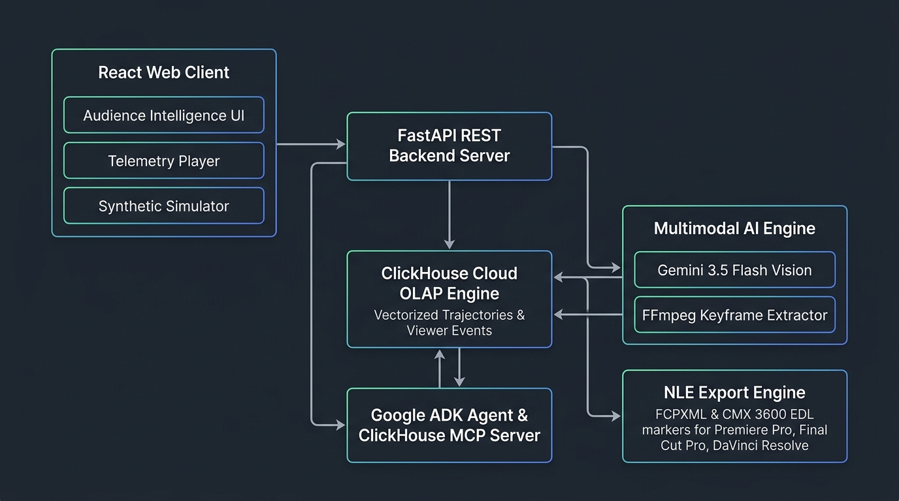

# Frame Sense System Architecture



This document details the production architecture of **Frame Sense**, detailing data flow, statistical gating, agent orchestration, multimodal vision investigation, ClickHouse OLAP windowing, and professional NLE export.

---

## 1. High-Level Architecture Overview

```
                          ┌──────────────────────────┐
                          │   React 18 / Vite Web    │
                          │   (Editorial Workspace)  │
                          └────────────┬─────────────┘
                                       │ HTTP / SSE Stream
                                       ▼
                          ┌──────────────────────────┐
                          │  FastAPI Backend Server  │
                          │      (Port 8001)         │
                          └─────┬──────────────┬─────┘
                                │              │
           ┌────────────────────┴──┐        ───┴──────────────────┐
           │                       │        │                     │
           ▼                       ▼        ▼                     ▼
┌────────────────────┐   ┌───────────────────┐  ┌──────────────────┐  ┌───────────────────┐
│ ClickHouse Cloud   │   │ Dual-Engine       │  │  FFmpeg Engine   │  │ NLE Export Engine │
│ Telemetry & State  │   │ Statistical Audit │  │ (Frame Extract)  │  │ (FCP XML & EDL)   │
└──────────┬─────────┘   └─────────┬─────────┘  └────────┬─────────┘  └───────────────────┘
           │                       │                     │
           │                       ▼                     │
           │             ┌───────────────────┐           │
           │             │ ClickHouse Window │           │
           │             │ SQL Inspector     │           │
           │             └───────────────────┘           │
           │                       │                     │
           └───────────────────────┼─────────────────────┘
                                   │
                                   ▼
                         ┌───────────────────┐
                         │  Google ADK &     │
                         │ Gemini 3.5 Flash / Gemini 3.5 Flash-Lite │
                         └───────────────────┘
```

---

## 2. Core Subsystems

### A. 100% ClickHouse Unified Data Architecture
- **Unified Telemetry & Studio Metadata Storage**: ClickHouse columnar database storing second-by-second viewer telemetry events (`viewer_events`), screening project metadata (`screenings`), editorial timeline comments (`comments`), saved AI vision investigations (`investigations`), and chat assistant history (`chat_sessions`, `chat_messages`).
- **ClickHouse Model Context Protocol (MCP)**: Implements `run_select_query` tool allowing AI agents to directly query all ClickHouse tables via parameterized SQL filters (`WHERE screening_id = '...'`).
- **Zero-SQLite Architecture**: Deletions, batch rollbacks, and project resets execute atomically in a single database engine, eliminating dual-storage consistency risks.

### B. Dual-Engine Intelligence Audit System
- **Engine 1: Viewer Retention & Cognitive Analytics (`_get_window_trajectories`)**: Runs ClickHouse SQL trajectory window queries evaluating full viewer session lifecycles ($N_{\text{exposed}}$, $N_{\text{permanent\_exits}}$, $N_{\text{replayed\_and\_continued}}$, $N_{\text{continued}}$).
- **Engine 2: Broadcast Quality & Technical Safety Audit**:
  - **Dialogue Audio Masking Risk**: Monitors background score loudness collisions and speech frequency notch overlap.
  - **Pacing Lulls**: Pinpoints low-engagement dead-space windows prior to audience exit drops.

### C. ClickHouse Analytical Window SQL Inspector
- **React Portal Modal**: Non-blocking window overlay mounted on `document.body` rendering live OLAP query mechanics.
- **SQL Mechanics**: Inspects window functions, Z-score formulas, and execution latency ($< 9\text{ms}$).
- **Whitespace & Formatting**: Preserves exact multi-line SQL spacing and keyword color highlighting with click-outside backdrop dismissal.

### D. End-to-End Intelligence Pipeline Simulator
- **4-Stage Interactive Animation**: Visualizes raw telemetry emission, statistical joint gating, keyframe laser scanning, and timecode-anchored AI Co-Pilot chat responses.

### E. Multimodal Vision Investigation Engine
- **Keyframe Extraction & Token Optimization**: Extracts keyframes at exact peak anomaly timecodes using FFmpeg. To protect against token quota limits, frame images are downscaled to 640px JPEGs (`-vf "scale='min(640,iw)':-1" -q:v 5`), reducing payload size from ~500KB to ~25KB per frame (85-90% token reduction).
- **Gemini 3.5 Flash / Gemini 3.5 Flash-Lite Reasoning**: Sends extracted image frames to Gemini alongside raw telemetry evidence for visual cut analysis, scene pacing, and framing investigation.
- **Fast Cache & `force_refresh=true` Bypass**: Saved investigation reports are cached in database storage. Initial requests return pre-calculated reports in $< 70\text{ms}$. When film editors click **Regenerate**, the web app passes `?force_refresh=true` to bypass the cache and force live FFmpeg keyframe extraction, ClickHouse MCP query execution, and Gemini Vision model reasoning.
- **Interactive Request Cancellation (`AbortController`)**: Generation and regeneration buttons dynamically transform into interactive **Stop** controls during execution. Client-side HTTP requests are bound to a web `AbortController` signal; clicking **Stop** aborts the fetch request and terminates backend processing cleanly without data corruption.
- **Quota & Rate Limit Fault Tolerance (HTTP 429)**: Implements exponential backoff retries (1.5s, 3.0s, 4.5s delays) for transient `RESOURCE_EXHAUSTED` / `429` API errors. If quotas remain exhausted, structured user-facing rate-limit notices are surfaced with clear diagnostic origin locations (`apps/api/agents/frame_sense_investigator.py`).
- **Scientific Honesty Taxonomy**:
  - **`OBSERVATION`**: Pure empirical telemetry evidence (counts, rates, z-scores, trajectory metrics).
  - **`INTERPRETATION`**: Behavioral meaning of signals (e.g. cognitive comprehension vs. audience abandonment).
  - **`HYPOTHESIS`**: Multimodal visual/narrative rationale.
  - **`VALIDATION`**: Proposed editing action & evidence quality tier.

### F. Sense AI Interactive Assistant & Low-Latency Stream
- **Google ADK Orchestration**: Uses `InMemoryRunner` with `sense_ai_chat_agent` and ClickHouse MCP.
- **Pre-Loaded Summary Context**: Injects screening metadata, live telemetry overview, and top anomaly findings directly into context header to bypass redundant remote MCP SQL roundtrips for general user queries.
- **Zero-Latency Token SSE Stream**: Server-Sent Events endpoint streaming LLM tokens directly over HTTP (`media_type="text/event-stream"`) without artificial sleep delays.
- **Stream Controller**: Supports frontend response cancellation via circular `Stop` button / `AbortController`.

### G. Professional NLE Export (FCP XML & EDL)
- **Final Cut Pro XML (`.fcpxml`)**: Generates structured XML sequences with markers, duration metadata, and editorial notes compatible with **Adobe Premiere Pro**, **DaVinci Resolve**, and **Final Cut Pro**.
- **Edit Decision List (`.edl`)**: CMX3600-compliant EDL generator for legacy post-production suites.

---

## 3. Data Processing & Investigation Pipeline

```
1. Browser Player / Simulator -> Emits ViewerEvent batch -> FastAPI /telemetry/batch -> ClickHouse
2. GET /audience/anomalies -> Runs Joint Gating & Dual-Engine Audit -> Returns candidate anomalies & safety alerts
3. User clicks "Inspect ClickHouse Window SQL" -> React Portal renders ClickHouseSqlInspector with live OLAP query
4. User clicks "Investigate Anomaly" -> FFmpeg extracts keyframe at timecode
5. Gemini 3.5 Flash / Gemini 3.5 Flash-Lite -> Analyzes keyframe + telemetry -> Constructs 4-part taxonomy report
6. Report stored atomically in ClickHouse `investigations` table -> Rendered in Editorial Findings Workspace
7. Click "Export XML/EDL" -> Generates FCP XML/EDL file for NLE timeline
```

